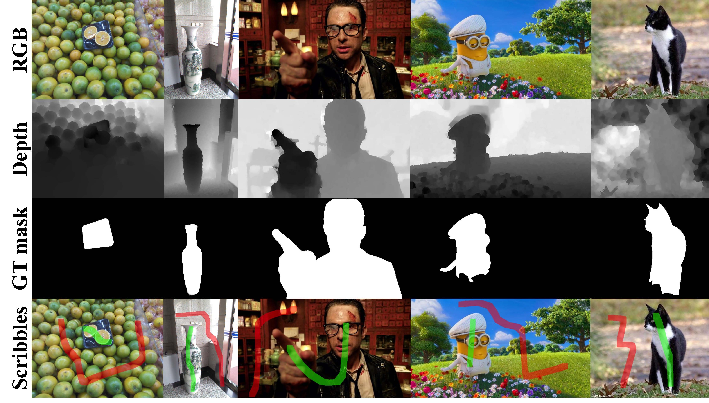

# Scribble RGB-D SOD
This repository includes datasets, code and results for our paper:

[Weakly Supervised RGB-D Salient Object Detection with Prediction Consistency Training and Active Scribble Boosting, IEEE TIP 2022](https://ieeexplore.ieee.org/abstract/document/9720104)

> **Abstract:** *RGB-D salient object detection (SOD) has attracted increasingly more attention as it shows more robust results in complex scenes compared with RGB SOD. However, state-of-the-art RGB-D SOD approaches heavily rely on a large amount of pixel-wise annotated data for training. Such densely labeled annotations are often labor-intensive and costly. To reduce the annotation burden, we investigate RGB-D SOD from a weakly supervised perspective. More specifically, we use annotator-friendly scribble annotations as supervision signals for model training. Since scribble annotations are much sparser compared to ground-truth masks, some critical object structure information might be neglected. To preserve such structure information, we explicitly exploit the complementary edge information from two modalities ( i.e. , RGB and depth). Specifically, we leverage the dual-modal edge guidance and introduce a new network architecture with a dual-edge detection module and a modality-aware feature fusion module. In order to use the useful information of unlabeled pixels, we introduce a prediction consistency training scheme by comparing the predictions of two networks optimized by different strategies. Moreover, we develop an active scribble boosting strategy to provide extra supervision signals with negligible annotation cost, leading to significant SOD performance improvement. Extensive experiments on seven benchmarks validate the superiority of our proposed method. Remarkably, the proposed method with scribble annotations achieves competitive performance in comparison to fully supervised state-of-the-art methods.*

 

## Installation
### Requirements
- Linux with Python ≥ 3.6
- CUDA == 9.2
- PyTorch == 1.4 and torchvision that matches the PyTorch installation
- cv2, tqdm, scikit-learn

Note, other PyTorch and CUDA versions may bring performance degradation.

## Data Preparation
### Scribble RGB-D SOD Datasets (NJU2K-S & NLPR-S)
- We manually re-label two widely used publicly available RGB-D SOD benchmarks (*i.e.*, NJU2K and NLPR) with scribble annotattions, and use them as the training datasets.
Please find the scribble datasets from [Google Drive](https://drive.google.com/file/d/1YBnBeMtI6AnM61KFi-THkLgoCw5GlBFH/view?usp=share_link) | [Baidu Pan](https://pan.baidu.com/s/1-JdRi8FhSfobCGufXXdViA?pwd=55mw).

- We use seven commonly used RGB-D SOD benchmarks (*i.e.*, DES, LFSD, NJU2K_Test, NLPR_Test, SIP, SSD, STERE) as the testing datasets. Please find the testing datasets from [Google Drive](https://drive.google.com/file/d/1vLSolPQ_luChn2kfqXbpv4JmlQy6LHVR/view?usp=share_link) | [Baidu Pan](https://pan.baidu.com/s/1o0x_igp_MVH1k88fI5qBYQ?pwd=97ua).

Download and unzip the training and testing datasets. The dataset directory needs to have the following directory structure:
```
dataset
├── train_data/
|   └── {depth,gray,gt,gt_mask,img,mask}/
└── test_data/
    └── {depth,gt,img}/
        └── {DES,LFSD,NJU2K_Test,NLPR_Test,SIP,SSD,STERE}/
```
The `gt`, `mask` and `gt_mask` in train_data contain foreground scribbles, foreground+background scribbles and ground-truth masks respectively. The `gray` contains grayscale images converted using this [code](https://github.com/JingZhang617/Scribble_Saliency/blob/master/convert_rgb2gray.m).

We also provide the coarse scribbles labeled by annotator2 in [Google Drive](https://drive.google.com/drive/folders/1ZowRWZQg9bwuH-k_MXe4Z33x51Y2Xr_Z?usp=share_link) | [Baidu Pan](https://pan.baidu.com/s/1Y25pCu08XXIX84trVC4oWA?pwd=ii7u).

## Getting Started
### Training & Inference in Command Line

1. To train a warm-up stage model, run
```
python train.py --output_dir /path/to/checkpoint_dir --warmup_stage
```

2. To generate saliency maps using a trained warm-up stage model, run
```
python test.py --model_path /path/to/checkpoint_file --warmup_stage
```

3. To train a mutual learning stage model, run
```
python train.py --output_dir /path/to/checkpoint_dir --warmup_model /path/to/checkpoint_file
```

4. To generate saliency maps using a trained mutual learning stage model, run
```
python test.py --model_path /path/to/checkpoint_file
```

### Evaluation
- Python evaluation for MAE metric, run `mae_eval.py`

- MATLAB evaluation for all metrics, run `./matlab_measure/rgbd_metric.m`

## Results with Pre-trained Models
Our pre-trained models and predicted saliency maps are available. All models are trained on a single NVIDIA V100-32G GPU. Average results over seven RGB-D SOD benchmarks are reported. 

<table><tbody>
<!-- START TABLE -->
<!-- TABLE HEADER -->
<th valign="bottom">Name</th>
<th valign="bottom">$S_{\alpha}$</th>
<th valign="bottom">$F_{\beta}^\text{mean}$</th>
<th valign="bottom">$E_{\xi}^\text{mean}$</th>
<th valign="bottom">MAE</th>
<th valign="bottom">download (Google Drive)</th>
<th valign="bottom">download (Baidu Pan)</th>
<!-- TABLE BODY -->

<tr><td align="left">SSAL-D</td>
<td align="center">.8399</td>
<td align="center">.8243</td>
<td align="center">.8959</td>
<td align="center">.0612</td>
<td align="center"><a href="https://drive.google.com/drive/folders/13rwi_49Gcy_cE1xpCvKdscA7MtS537Tu?usp=share_link">saliency maps</a></td>
<td align="center"><a href="https://pan.baidu.com/s/1fbLJY5xq8BkpSB78LYBfag?pwd=vd88">saliency maps</a></td>
</tr>

<tr><td align="left">SCWC-D</td>
<td align="center">.8415</td>
<td align="center">.8280</td>
<td align="center">.9008</td>
<td align="center">.0604</td>
<td align="center"><a href="https://drive.google.com/drive/folders/1GnlfV41-ug_hnj221g-wlLVYZtcPuLaU?usp=share_link">saliency maps</a></td>
<td align="center"><a href="https://pan.baidu.com/s/1-ZZfILgBYWYZYvxgxffglA?pwd=2653">saliency maps</a></td>
</tr>

<tr><td align="left">BBSNet-W</td>
<td align="center">.8469</td>
<td align="center">.8072</td>
<td align="center">.9030</td>
<td align="center">.0593</td>
<td align="center"><a href="https://drive.google.com/drive/folders/14RAgHItZwSEwqI9O9jQWmAX8OaVVlsCq?usp=share_link">saliency maps</a></td>
<td align="center"><a href="https://pan.baidu.com/s/15h8BMlX__OO-PGnyKE_F7Q?pwd=iwij">saliency maps</a></td>
</tr>

<tr><td align="left">ours w/o pct</td>
<td align="center">.8529</td>
<td align="center">.8359</td>
<td align="center">.9041</td>
<td align="center">.0566</td>
<td align="center"><a href="https://drive.google.com/file/d/1NbcGxeYwfwj4P7vlvTa0yrhc5sFqAcsy/view?usp=share_link">model</a>&nbsp;|&nbsp;<a href="https://drive.google.com/drive/folders/1pRlW1sTMVh16yeCDakaaZZq740OUGpgG?usp=share_link">saliency maps</a></td>
<td align="center"><a href="https://pan.baidu.com/s/1yPtGMwijaz-TXJCUiLDHew?pwd=ctbf">model</a>&nbsp;|&nbsp;<a href="https://pan.baidu.com/s/1DhEBWjq5PUMj2J4dgBA3vQ?pwd=rr4u">saliency maps</a></td>
</tr>

<tr><td align="left">ours</td>
<td align="center">.8633</td>
<td align="center">.8398</td>
<td align="center">.9096</td>
<td align="center">.0549</td>
<td align="center"><a href="https://drive.google.com/file/d/17ip6LGDjLbiZFcsVj-vEdxt_x5RS89sP/view?usp=share_link">model</a>&nbsp;|&nbsp;<a href="https://drive.google.com/drive/folders/190KC-qcsXI7B7MDyDclRoKm92b1Qpnm3?usp=share_link">saliency maps</a></td>
<td align="center"><a href="https://pan.baidu.com/s/131uScdXfpOvO3xUfLP8Y3A?pwd=2ppp">model</a>&nbsp;|&nbsp;<a href="https://pan.baidu.com/s/1mCEy3AljdSjxaap6YsYGUA?pwd=vsu1">saliency maps</a></td>
</tr>

<tr><td align="left">ours (anno2)</td>
<td align="center">.8550</td>
<td align="center">.8245</td>
<td align="center">.9036</td>
<td align="center">.0596</td>
<td align="center"><a href="https://drive.google.com/file/d/1JSUCrgp4a2I6jOytKViTB_ZnEyEqQCKP/view?usp=share_link">model</a>&nbsp;|&nbsp;<a href="https://drive.google.com/drive/folders/1iO0RGj_LLqCpdgHWG2Vsj2kEXCSpiEGM?usp=share_link">saliency maps</a></td>
<td align="center"><a href="https://pan.baidu.com/s/1FV6dmOzM4haDNKey70vHXA?pwd=jqx3">model</a>&nbsp;|&nbsp;<a href="https://pan.baidu.com/s/1wb3bPWkOfQrnihg8-MoAvQ?pwd=sr1r">saliency maps</a></td>
</tr>

<tr><td align="left">ours+</td>
<td align="center">.8619</td>
<td align="center">.8401</td>
<td align="center">.9094</td>
<td align="center">.0543</td>
<td align="center"><a href="https://drive.google.com/file/d/1Xob7OHxFRzhzQQr52qhUyuI8NSyVXTYG/view?usp=share_link">model</a>&nbsp;|&nbsp;<a href="https://drive.google.com/drive/folders/1gIc-K_nUF9-IzkseWRwYmYFd-XADifSK?usp=share_link">saliency maps</a></td>
<td align="center"><a href="https://pan.baidu.com/s/1sCj_x8MWJ2mlYW4FtcxBfQ?pwd=8jcr">model</a>&nbsp;|&nbsp;<a href="https://pan.baidu.com/s/1NckBcY_zD2qD_s6MnSF7Bg?pwd=rw4x">saliency maps</a></td>
</tr>

<tr><td align="left">ours+10%ABS</td>
<td align="center">.8677</td>
<td align="center">.8456</td>
<td align="center">.9115</td>
<td align="center">.0529</td>
<td align="center"><a href="https://drive.google.com/file/d/1cV7Sa0yuWrm2uNieIOtBGzEEUUdyETRo/view?usp=share_link">model</a>&nbsp;|&nbsp;<a href="https://drive.google.com/drive/folders/1y-4cVRadngaFSkzq8aaZHwENyKfA19-g?usp=share_link">saliency maps</a></td>
<td align="center"><a href="https://pan.baidu.com/s/1-Fcvvlnh8KjZLFMsD-4XuQ?pwd=pm3n">model</a>&nbsp;|&nbsp;<a href="https://pan.baidu.com/s/1P1FfHhXcjgcFQ742uBC84A?pwd=9geu">saliency maps</a></td>
</tr>

<!-- END OF TABLE BODY -->
</tbody></table>

- `SSAL-D`, `SCWC-D` and `BBSNet-W` are our implemented scribble-based RGB-D SOD variants.

- `ours w/o pct` is the warm-up stage model. To obtain saliency maps using the pre-trained models run
```
python test.py --model_path /path/to/checkpoint_file --warmup_stage
```

- `ours` and `ours(anno2)` are the mutual learning stage models trained with scribbles labeled by annotator1 (default) and annotator2 respectively. To obtain saliency maps using the pre-trained models run
```
python test.py --model_path /path/to/checkpoint_file 
```

- `ours+` and `ours+10%ABS` are the second-round models, where `ours+` is self-training model without extra scribbles and `ours+10%ABS` is trained with 10% extra scribbles selected by ABS. To obtain saliency maps using the pre-trained models run
```
python test.py --model_path /path/to/checkpoint_file --second_round
```

## Citation
If you find this project useful for your research, please use the following BibTeX entry.
```BibTeX
@article{xu2022weakly,
  title={Weakly Supervised RGB-D Salient Object Detection with Prediction Consistency Training and Active Scribble Boosting},
  author={Xu, Yunqiu and Yu, Xin and Zhang, Jing and Zhu, Linchao and Wang, Dadong},
  journal={IEEE Transactions on Image Processing},
  year={2022},
  volume={31},
  pages={2148-2161},
  doi={10.1109/TIP.2022.3151999}
}
```

## License
This project is released under the [MIT license](LICENSE).

## Acknowledgement
We build the project based on [Scribble_Saliency](https://github.com/JingZhang617/Scribble_Saliency). Thanks for their contribution.

## Contact
If you have any questions, please drop me an email: imyunqiuxu@gmail.com
